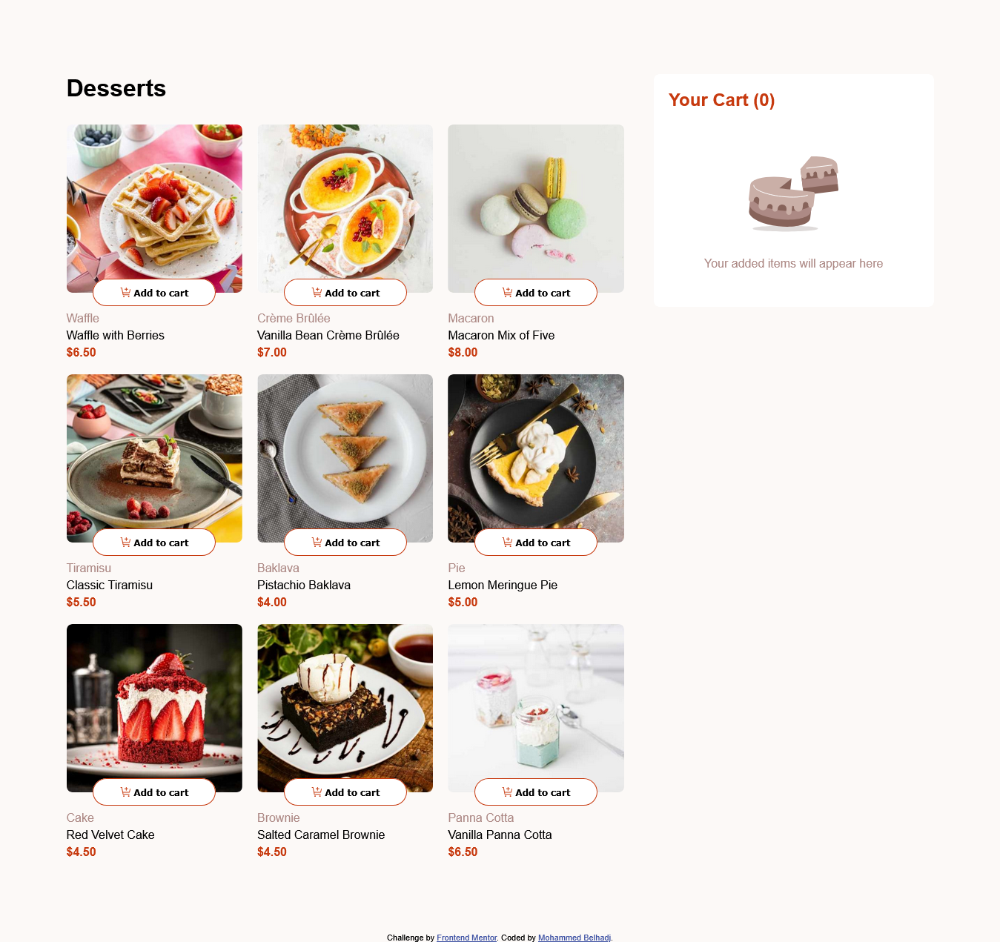

# Frontend Mentor - Desserts List with Cart 🍰🛒

This project is a solution to the [Product List with Cart challenge on Frontend Mentor](https://www.frontendmentor.io/challenges/product-list-with-cart-5MmqLVAp_d).  
The challenge focuses on creating a responsive product list where users can add desserts to a shopping cart, adjust quantities, and confirm their order.

## 🚀 Overview

### ✅ Features

Users can:

- Add items to the cart and remove them completely
- Increase/decrease item quantities directly from the product list or the cart
- View a confirmation modal when placing the order
- Reset and start a new order
- Enjoy a responsive layout optimized for mobile, tablet, and desktop
- Experience hover and focus states on all interactive elements

### 📸 Screenshot



### 🔗 Links

- **Solution URL:** [Here](https://www.frontendmentor.io/solutions/products-list-with-cart-iX2jNeaFKC)
- **Live Demo:** [Here](https://m07ammed18.github.io/Desserts-list-with-cart/)

---

## 🛠 My Process

### 🔧 Built With

- Semantic **HTML5**
- **CSS Grid** & **Flexbox**
- **SCSS / SASS**
- **Vanilla JavaScript**
- JSON + `fetch()` API

### 💡 What I Learned

Working on this challenge improved my ability to fetch data dynamically and render products from a JSON file.  
Example of fetching data:

```js
fetch("data.json")
  .then((res) => res.json())
  .then((data) => {
    allProducts = data;
    showProducts(data);
  });
````

### 📚 Useful Resources

* [Elzero Web School](https://www.youtube.com/@ElzeroWebSchool) — A great explanation of the Fetch API and handling JSON data.

---

## 👤 Author

* GitHub — [Mohammed Belhadj](https://github.com/m07ammed18)
* Frontend Mentor — [@m07ammed18](https://www.frontendmentor.io/profile/m07ammed18)
